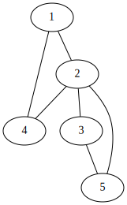
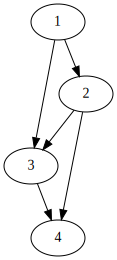
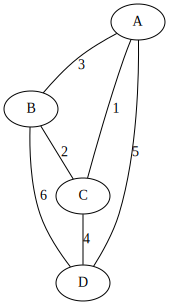
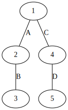
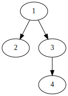

# graph-it

[](https://github.com/c-fraser/graph-it/actions)
[](https://github.com/c-fraser/graph-it/releases)
[](https://search.maven.org/search?q=g:io.github.c-fraser%20AND%20a:graph-it*)
[](https://www.apache.org/licenses/LICENSE-2.0)

`graph-it` is a Kotlin (multiplatform) library for interacting with interconnected objects through a
flexible graph data structure.

## Contents

<!--- TOC -->

* [Features](#features)
* [Usage](#usage)
* [Examples](#examples)
  * [Create an undirected graph of integers](#create-an-undirected-graph-of-integers)
  * [Create a directed acyclic graph of integers](#create-a-directed-acyclic-graph-of-integers)
  * [Create a weighted graph](#create-a-weighted-graph)
  * [Create a graph with generic edge attributes](#create-a-graph-with-generic-edge-attributes)
  * [Traverse a graph ([depth-first search](https://en.wikipedia.org/wiki/Depth-first_search))](#traverse-a-graph-depth-first-searchhttps:enwikipediaorgwikidepth-first_search)
  * [Find the shortest path between vertices](#find-the-shortest-path-between-vertices)
  * [Visualize a graph with [Graphviz](https://graphviz.org/)](#visualize-a-graph-with-graphvizhttps:graphvizorg)
* [License](#license)
* [Acknowledgements](#acknowledgements)

<!--- END -->

## Features

* Flexible `Graph` interface which supports
  multiple [graph types](https://en.wikipedia.org/wiki/Graph_(discrete_mathematics)#Definitions).
* Vertices and be `Any` type.
* Edges may contain a `weight` or generic `attributes`.
* Type-safe builder DSL which validates the graph type constraints.
* [Depth-first](https://en.wikipedia.org/wiki/Depth-first_search)
  and [breadth-first](https://en.wikipedia.org/wiki/Breadth-first_search) traversal.
* [Dijkstra's shortest path algorithm](https://en.wikipedia.org/wiki/Dijkstra%27s_algorithm).
* `Graph` visualization through [Graphviz](https://graphviz.org/).

## Usage

The `graph-it` library is accessible
via [Maven Central](https://search.maven.org/search?q=g:io.github.c-fraser%20AND%20a:graph-it*).

## Examples

### Create an undirected graph of integers



<!--- TEST_NAME Example01Test --> 

<!--- INCLUDE
import io.github.cfraser.graphit.buildGraph

fun runExample01() {
println(
----- SUFFIX 
)
}
-->

```kotlin
buildGraph {
  this += 1 to 2
  this += 1 to 4
  this += 2 to 3
  this += 2 to 4
  this += 2 to 5
  this += 3 to 5
}
```

<!--- KNIT Example01.kt --> 
<!--- TEST
strict graph {
1 -- 2;
1 -- 4;
2 -- 3;
2 -- 4;
2 -- 5;
3 -- 5;
}
-->

<!---
echo '
strict graph {
1 -- 2;
1 -- 4;
2 -- 3;
2 -- 4;
2 -- 5;
3 -- 5;
}
' | dot -Tsvg > docs/example-01.svg
-->

### Create a directed acyclic graph of integers



<!--- TEST_NAME Example02Test --> 

<!--- INCLUDE
import io.github.cfraser.graphit.Feature.ACYCLIC
import io.github.cfraser.graphit.Feature.DIRECTED
import io.github.cfraser.graphit.buildGraph

fun runExample02() {
println(
----- SUFFIX 
)
}
-->

```kotlin
buildGraph(DIRECTED, ACYCLIC) {
  this += 1 to 2
  this += 1 to 3
  this += 2 to 3
  this += 2 to 4
  this += 3 to 4
}
```

<!--- KNIT Example02.kt --> 
<!--- TEST
strict digraph {
1 -> 2;
1 -> 3;
2 -> 3;
2 -> 4;
3 -> 4;
}
-->

<!---
echo '
strict digraph {
1 -> 2;
1 -> 3;
2 -> 3;
2 -> 4;
3 -> 4;
}
' | dot -Tsvg > docs/example-02.svg
-->

### Create a weighted graph



<!--- TEST_NAME Example03Test --> 

<!--- INCLUDE
import io.github.cfraser.graphit.buildGraph

fun runExample03() {
println(
----- SUFFIX 
)
}
-->

```kotlin
buildGraph {
  this += "A" to "B" weighs 3
  this += "A" to "C" weighs 1
  this += "A" to "D" weighs 5
  this += "B" to "D" weighs 6
  this += "B" to "C" weighs 2
  this += "C" to "D" weighs 4
}
```

<!--- KNIT Example03.kt --> 
<!--- TEST
strict graph {
A -- B [weight=3, label=3];
A -- C [weight=1, label=1];
A -- D [weight=5, label=5];
B -- D [weight=6, label=6];
B -- C [weight=2, label=2];
C -- D [weight=4, label=4];
}
-->

<!---
echo '
strict graph {
A -- B [weight=3, label=3];
A -- C [weight=1, label=1];
A -- D [weight=5, label=5];
B -- D [weight=6, label=6];
B -- C [weight=2, label=2];
C -- D [weight=4, label=4];
}
' | dot -Tsvg > docs/example-03.svg
-->

### Create a graph with generic edge attributes



<!--- TEST_NAME Example04Test --> 

<!--- INCLUDE
import io.github.cfraser.graphit.buildGraph

fun runExample04() {
println(
----- SUFFIX 
)
}
-->

```kotlin
buildGraph {
  this += 1 to 2 with "A"
  this += 2 to 3 with "B"
  this += 1 to 4 with "C"
  this += 4 to 5 with "D"
}
```

<!--- KNIT Example04.kt --> 
<!--- TEST
strict graph {
1 -- 2 [label="A"];
1 -- 4 [label="C"];
2 -- 3 [label="B"];
4 -- 5 [label="D"];
}
-->

<!---
echo '
strict graph {
1 -- 2 [label="A"];
1 -- 4 [label="C"];
2 -- 3 [label="B"];
4 -- 5 [label="D"];
}
' | dot -Tsvg > docs/example-04.svg
-->

### Traverse a graph ([depth-first search](https://en.wikipedia.org/wiki/Depth-first_search))



<!--- TEST_NAME Example05Test --> 

<!--- INCLUDE
import io.github.cfraser.graphit.buildGraph
import io.github.cfraser.graphit.DepthFirst
import io.github.cfraser.graphit.Feature.DIRECTED

fun runExample05() {
----- SUFFIX
}
-->

```kotlin
val graph = buildGraph(DIRECTED) {
  this += 1 to 2
  this += 1 to 3
  this += 3 to 4
}
val vertices = graph.traverse(DepthFirst(1))
println(vertices.joinToString())
```

```text
1, 3, 4, 2
```

<!--- KNIT Example05.kt --> 
<!--- TEST -->

<!---
echo '
strict digraph {
1 -> 2;
1 -> 3;
3 -> 4;
}
' | dot -Tsvg > docs/example-05.svg
-->

### Find the shortest path between vertices


<!--- TEST_NAME Example06Test --> 

<!--- INCLUDE
import io.github.cfraser.graphit.buildGraph
import io.github.cfraser.graphit.DepthFirst

fun runExample06() {
----- SUFFIX
}
-->

```kotlin
val graph = buildGraph {
  this += "A" to "C" weighs 3
  this += "A" to "F" weighs 2
  this += "C" to "F" weighs 2
  this += "C" to "D" weighs 4
  this += "C" to "E" weighs 1
  this += "F" to "E" weighs 3
  this += "F" to "B" weighs 6
  this += "F" to "G" weighs 5
  this += "D" to "B" weighs 1
  this += "E" to "B" weighs 2
  this += "G" to "B" weighs 2
}
val path = graph.shortestPath("A" to "B")
println(path.joinToString())
```

```text
A, C, E, B
```

<!--- KNIT Example06.kt --> 
<!--- TEST -->

<!---
echo '
strict graph {
A -- C [weight=3, label=3];
A -- F [weight=2, label=2];
C -- F [weight=2, label=2];
C -- D [weight=4, label=4];
C -- E [weight=1, label=1];
F -- E [weight=3, label=3];
F -- B [weight=6, label=6];
F -- G [weight=5, label=5];
D -- B [weight=1, label=1];
E -- B [weight=2, label=2];
B -- G [weight=2, label=2];
}
' | dot -Tsvg > docs/example-06.svg
-->

### Visualize a graph with [Graphviz](https://graphviz.org/)

`Graph.toString()` returns the [DOT language](https://graphviz.org/doc/info/lang.html)
representation of the graph instance.

```kotlin
val graph = buildGraph {
  this += 1 to 2
  this += 1 to 3
}
// Print the graph description
println("$graph")
// Or... write the graph description to a file
File("graph.dot").writeText("$graph")
```

A visualization of the graph can be generated from the graph description using
the [dot command](https://graphviz.org/doc/info/command.html).

```bash
# Pipe in the graph description
echo "$GRAPH_DESCRIPTION" | dot -Tsvg > graph.dot.svg
# Or... specify the graph description file
dot -Tsvg -O graph.dot
```

## License

    Copyright 2022 c-fraser
    
    Licensed under the Apache License, Version 2.0 (the "License");
    you may not use this file except in compliance with the License.
    You may obtain a copy of the License at
    
        https://www.apache.org/licenses/LICENSE-2.0
    
    Unless required by applicable law or agreed to in writing, software
    distributed under the License is distributed on an "AS IS" BASIS,
    WITHOUT WARRANTIES OR CONDITIONS OF ANY KIND, either express or implied.
    See the License for the specific language governing permissions and
    limitations under the License.

## Acknowledgements

Kudos to the [(Go) graph package](https://github.com/dominikbraun/graph) which significantly
influenced the implementation of `graph-it`.
